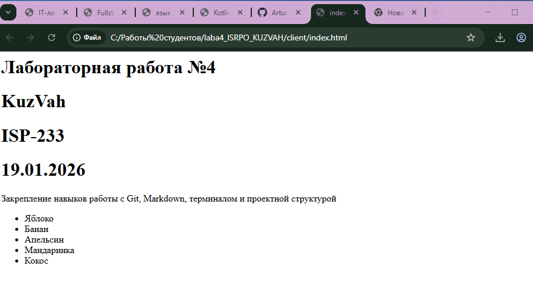

# Лабораторная работа №4. Закрепление навыков работы с Git, Markdown

## Автор

**ФИО:** Артур Вахрушева 
**Группа:** исп-233  
**Дата:** 30.01.2026
---

## Описание проекта

Данный гит репозиторий содержит всю теоритическую часть о мощности markdown

---

## Содержание

- [Описание проекта](#описание-проекта)
- [Структура проекта](#структура-проекта)
- [Примеры Markdown](#примеры-markdown)
- [Репозиторий](#репозиторий)
- [Latex](#latex)
- [Скриншоты](#скриншот)
- [Заключение](#заключение)

---

## Структура проекта

- README.md  
- client/
    - about.html
    - index.html
- docs/
    - latex_examples.md
    - markdown_examples.md
- terminal_practice/
    - data/
        - text.txt
    - logs/
        - app.log
- server/
    - bin/
        - net/
    - obj/
        - Debug/

- repo/
    - ...png
    - ...png

---

## Примеры Markdown

### Заголовок 3

#### Пример заголовка 4

---

### Список

- это список
- еще список
  - вложил список
  - Ещё один вложенный 

---

### Картинка

)

---

### Код

```bash
git commit -m "very strange code"
```

### Репозиторий

-[Назад в будущее(репозиторий на гит)](https://github.com/Arturnio/Laba4_ISRPO_KuzVah.git)

### Скриншот



### latex

Пифагор: $a^2 + b^2 = c^2$

---

$$
\sum_{i=1}^n i = \frac{n(n+1)}{2}
$$

### Заключение

В ходе данной лабораторной работы мы закрепили знания полученные во время изучения других лабораторных работ. Это была действительно хорошая практика которая поможет описать твой проект 